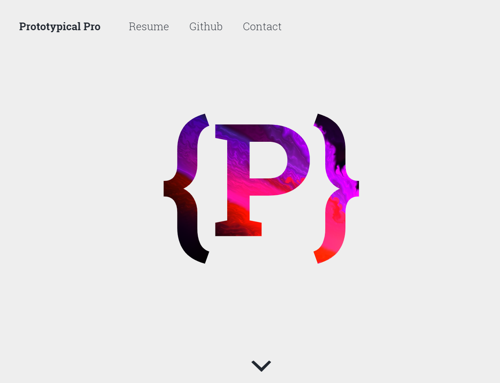

# Prototypical Pro

This repository houses the source code for my personal website. I created this website to showcase my technical skills with a creative and visually striking presentation.

This website is bootstrapped with [create-react-app](https://facebook.github.io/create-react-app/) and [styled-components](https://www.styled-components.com/), with the goal of aggregating the HTML, CSS, and JS into one contiguous project. In addition, the build pipeline has been modified to include [react-snap](https://github.com/stereobooster/react-snap), which decreases time-to-paint on mobile devices.

The fluid effect is a combination of an SVG and some [amazing WebGL shaders](https://github.com/PavelDoGreat/WebGL-Fluid-Simulation) written by PavelDoGreat. I have refactored PavelDoGreat's work into a React component, and created some classes that help move the fluid across the picture.

Finally, the `Git Commits` and `Hours` numbers are calculated daily by a [function hosted on AWS](https://github.com/prototypicalpro/LambdaWorkspace), and will increase periodically.

